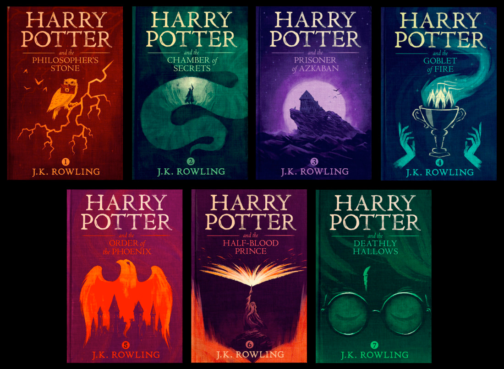

***

:books:*currently reading*: [Anna Karenina - Leo Tolstoy](https://books2read.com/u/brWQZE)

***

The following list contains my favorite books - both fiction and non-fiction - in no particular order. Of course, this post will probably evolve over time and I will do a regular update.

# 1. [Harry Potter - J.K. Rowling](https://www.amazon.com/gp/bookseries/B00CJG28U8)

I am sorry for starting a list of top 10 books with a series, but I couldn't help it. To anyone that knows me this should not come as a surprise anyways, since I am a huge Potterhead. :smile:

***

# 2. [A Little Life - Hanya Yanagihara](https://books2read.com/u/bOxW1g)

{width=250px}

It may be dark and traumatic, but Hanya Yanagihara’s second novel offers a refreshingly modern take on friendship in the age of anxiety. You find more compelling reasons for reading this book in this [article](https://www.theguardian.com/books/2016/jan/20/a-little-life-why-everyone-should-read-this-modern-day-classic).

***

# 3. [Thinking, Fast and Slow - Daniel Kahneman](https://books2read.com/u/4jWZKD)

Daniel Kahneman - world-famous psychologist and winner of the Nobel Prize in Economics - takes you on a groundbreaking tour of the mind and explains the two systems that drive the way we think.

***

# 4. [Sapiens - Yuval Noah Harari](https://books2read.com/u/4AKGgK)

{width=250px}

The most important book about the history of humankind. I also suggest that you look up the [author](https://www.ynharari.com) and consider reading the follow-up books - they are brilliant too.  

***

# 5. [1984 - George Orwell](https://books2read.com/u/4XnWge)

{width=250px}

It’s almost impossible to talk about propaganda, surveillance, authoritarian politics, or perversions of truth without dropping a reference to 1984. Unfortunately, all of these topics are still as relevant today, as they were back in 1949, when this dystopian novel was published. Big Brother is watching you... 

***

# 6. [Brave New World - Aldous Huxley](https://books2read.com/u/barRPL)

{width=250px}

This profoundly important classic of world literature, is a searching vision of an unequal, technologically-advanced future where humans are genetically bred, socially indoctrinated, and pharmaceutically anesthetized to passively uphold an authoritarian ruling order–all at the cost of our freedom, full humanity, and perhaps also our souls. 

***

# 7. [Flow - Mihaly Csikszentmihalyi](https://books2read.com/u/bwd08y)

{width=250px}

The idea behind this books is to explain how, by ordering the information that enters our consciousness, we can discover true happiness and greatly improve the quality of our lives. By following its guidelines, this book makes me happy every day. :blush:

***

# 8. [A Gentleman in Moscow - Amor Towles](https://books2read.com/u/meel0l)

{width=250px}

A novel about a man who is ordered to spend the rest of his life inside a luxury hotel. Perhaps the ultimate quarantine read. Also I am ~~mildly~~ obsessed with Mother Russia :ru:.

***

# 9. [Evil PLans - Hugh MacLeod](https://books2read.com/u/b6ZgQp)

{width=250px}

If you want to have fun on your road to world domination. :smiling_imp:

***

# 10. [How to Predict the Unpredictable - William Poundstone](https://books2read.com/u/mKzW9B)

{width=250px}

We are hard-wired to believe that the world is more predictable than it is. We chase ‘winning streaks’ that are often just illusions, and we are all too predictable exactly when we try hardest not to be. This one goes out to all the gamblers :black_joker::game_die:.

***

I hope you give these books a try and please let me know about your favorite books in the comments section down below.

Cheers, Nicola :call_me_hand: