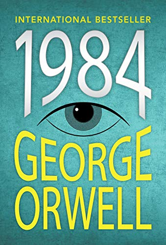
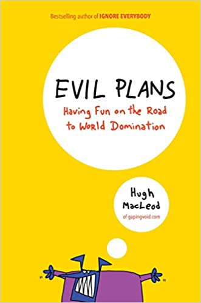

***

:books:*currently reading*: [Anna Karenina - Leo Tolstoy](https://books2read.com/u/brWQZE)

***

The following list contains my favorite books - both fiction and non-fiction - in no particular order. Of course, this post will probably evolve over time and I will do a regular update.

# 1. [Harry Potter - J.K. Rowling](https://www.amazon.com/gp/bookseries/B00CJG28U8)

I am sorry for starting a list of top 10 books with a series, but I couldn't help it. To anyone that knows me this should not come as a surprise anyways, since I am a huge Potterhead. :smile:

***

# 2. [A Little Life - Hanya Yanagihara](https://books2read.com/u/bOxW1g)

{width=250px}

***

# 3. [Thinking, Fast and Slow - Daniel Kahneman](https://books2read.com/u/4jWZKD)

Daniel Kahneman - world-famous psychologist and winner of the Nobel Prize in Economics - takes you on a groundbreaking tour of the mind and explains the two systems that drive the way we think.

***

# 4. [Sapiens - Yuval Noah Harari](https://books2read.com/u/4AKGgK)

{width=250px}

The most important book about the history of humankind. I also suggest that you look up the [author](https://www.ynharari.com) and consider reading the follow-up books.  

***

# 5. [1984 - George Orwell](https://books2read.com/u/4XnWge)

{width=250px}

***

# 6. [Brave New World - Aldous Huxley](https://books2read.com/u/barRPL)

{width=250px}

***

# 7. [Flow - Mihaly Csikszentmihalyi](https://books2read.com/u/bwd08y)

{width=250px}

The idea behind this books is to explain how, by ordering the information that enters our consciousness, we can discover true happiness and greatly improve the quality of our lives. By following its guidelines, this book makes me happy every day :blush:.

***

# 8. [A Gentleman in Moscow - Amor Towles](https://books2read.com/u/meel0l)

{width=250px}

***

# 9. [Evil PLans - Hugh MacLeod](https://books2read.com/u/b6ZgQp)

{width=250px}

***

# 10.

